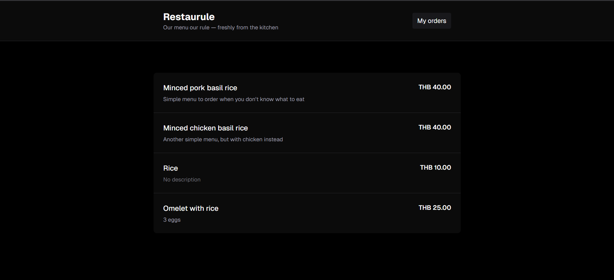
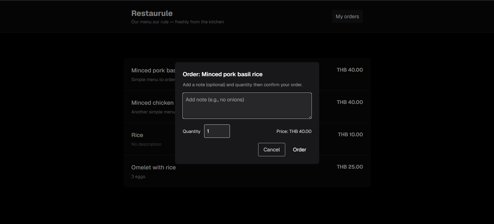
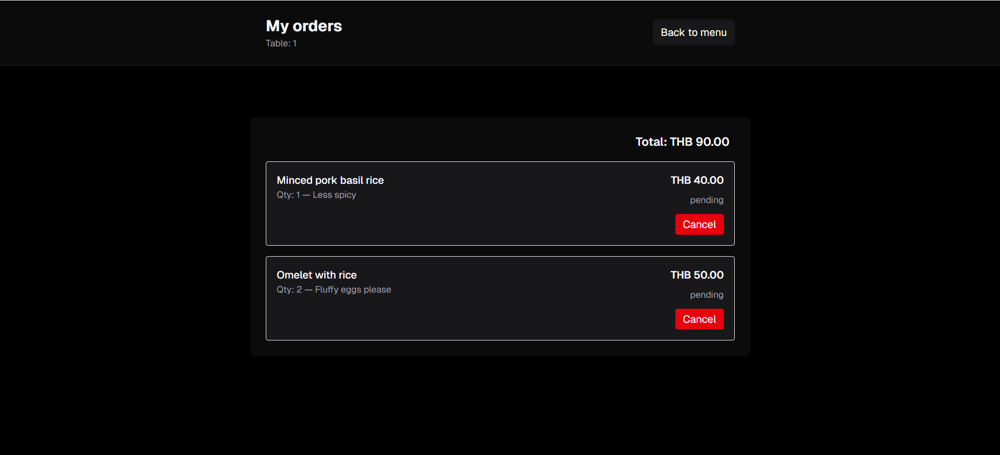
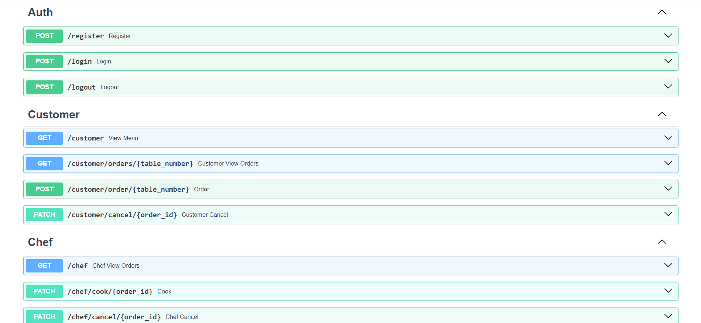
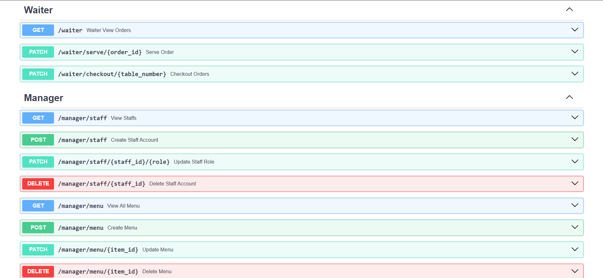

# Restaurule
Restaurule is a simple restaurant management system for customer, waiter, chef, and manager

# System architecture overview
The system is more like a mixed of service-based and layered architecture. Evidence is that data flow from the top most to bottom most layer with frontend as user interface, backend api is service or business layer, repository as data access layer, and database layer in the end.

In this system, service layer is partitioned by domain (chef, customer, waiter, and manager) with their own business rule.

# User roles and permissions
Each role have their own dedicated page which can only access by certain role (e.g. A user that logged in as chef cannot access waiter page) except customer which have no dedicated page

## Cutomer
- No authentication required
- View all available menu
- Create, view, cancel order
- Create and cancel order will require table number (Which the system will remember for 2 hours)
- Only able to cancel order with `pending` status (Change status `pending` -> `cancelled`)

## Chef
- Authentication required
- Only able to see order with `pending` and `cooking` status to prevent confusion
- Can change status of order (`pending` -> `cooking` or `cancelled`, `cooking` -> `serving` or `cancelled`)

## Waiter
- Authentication required
- See all active orders (Any status but `paid` and `cancelled`)
- Orders are grouped by table number for easy tracking
- Checkout orders (Change all orders' status to `paid`)
- Only able to checkout when all orders' status are `served`

## Manager
- Authentication required
- Staff management
  - View all staffs' information
  - Create staff account
  - Update role for staffs
  - Delete staff account
- Menu management
  - View all menu
  - Create menu
  - Update menu
  - Delete menu

# Technology stack
- Database: sqlite3
- Backend: FastAPI
- Frontend: Next.js

# Installation and setup instructions
## Prerequisite
- Docker desktop for [Windows](https://docs.docker.com/desktop/setup/install/windows-install/), [MacOS](https://docs.docker.com/desktop/setup/install/mac-install/), or [Linux](https://docs.docker.com/desktop/setup/install/linux/)
### 1. Clone this repository using command line interface (CLI)
```bash
git clone https://github.com/0CreepySmile0/Restaurule
cd restaurule
```

### 2. Custom environment variable (Optional)

Frontend
```bash
# Mac / Linux
cp frontend/sample.env.local frontend/.env.local

# Windows
copy frontend\sample.env.local frontend\.env.local
```
Adjust what you want
```
NEXT_PUBLIC_APP_NAME=Restaurule 
NEXT_PUBLIC_BASE_API_URL=http://localhost:8000
NEXT_PUBLIC_APP_QUOTE=Our menu our rule — freshly from the kitchen
# Put you desired icon in frontend/public and chage to /{your icon file name}
NEXT_PUBLIC_APP_ICON=/favicon.ico
NEXT_PUBLIC_APP_CURRENCY=THB
```

Backend
```bash
# Mac / Linux
cp backend/sample.env backend/.env

# Windows
copy backend\sample.env backend\.env
```
Adjust what you want
```
DB_FILE=app.db
MOCK_DATA=True
MAX_AGE=86400 # 1 day in second
HTTPS=False # Use https or http
ORIGINS=http://localhost:3000,http://localhost:3001
```

# Run the application
```bash
docker compose up -d --build
```
This will take a while, navigate to http://localhost:3000/ to see the app and http://localhost:8000/docs for API information

# Screenshots
Menu page


Attempt to order


View all active order


Api docs


